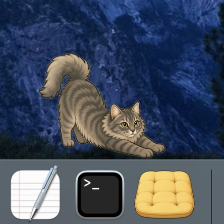
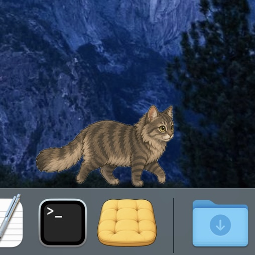
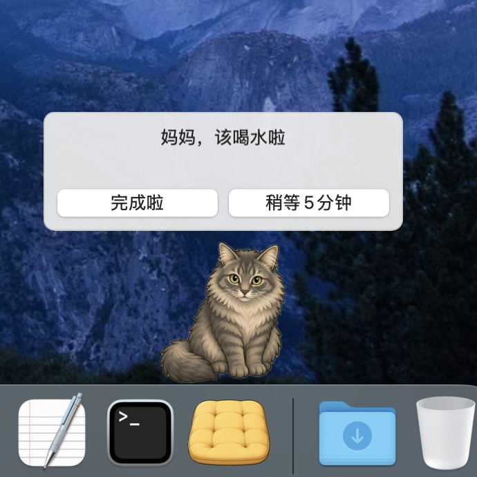
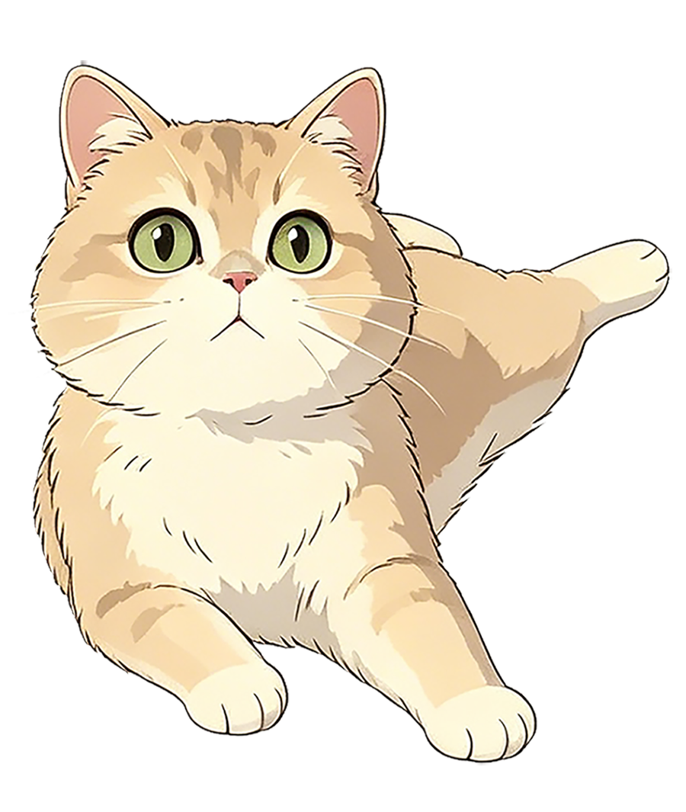
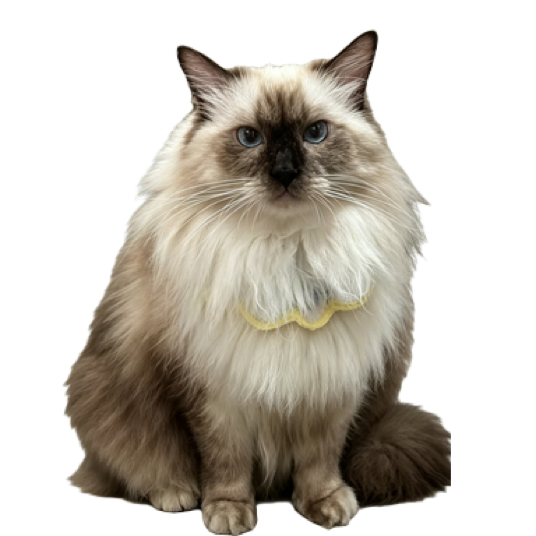
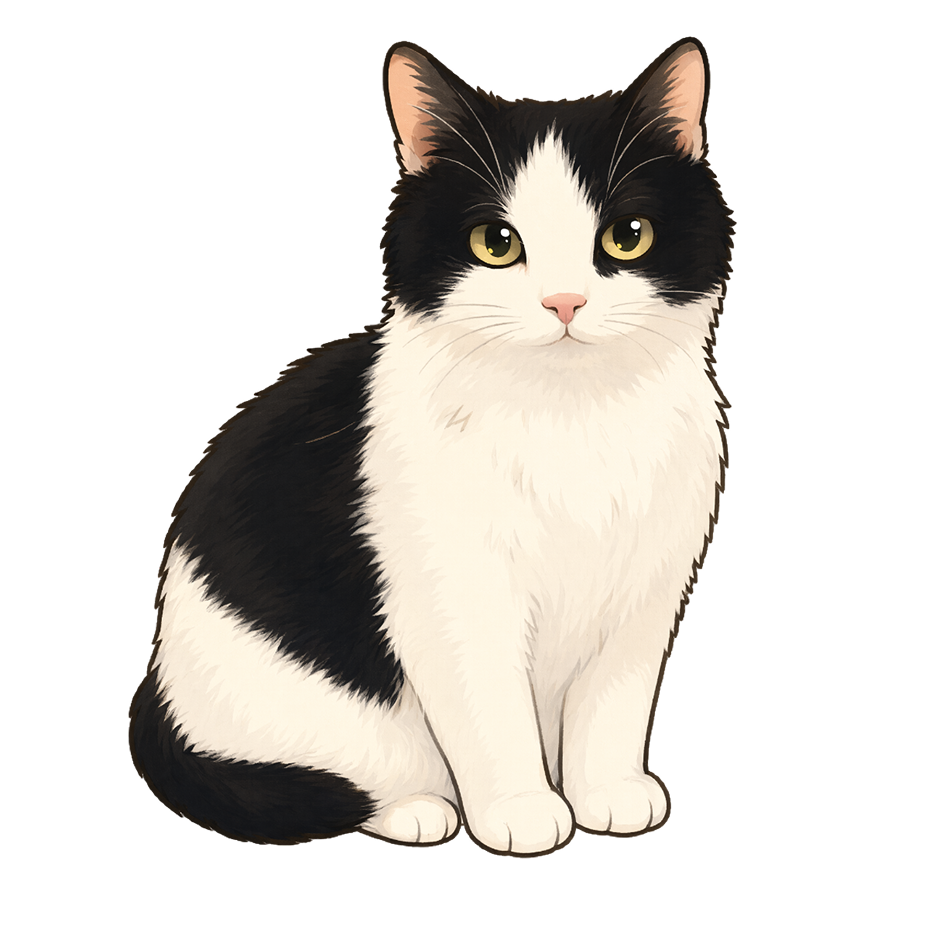

# 喵心心桌宠

这是以灰白矮脚猫“喵心心”为主角的 macOS 与 Windows 跨平台桌宠，基于 [Auwuua/DockCat](https://github.com/Auwuua/DockCat) v0.7.0（上游提交 `9dd4c4b`）制作。角色素材保留了喵心心的短腿比例、金色圆眼，以及蓝色圆珠配银色隔珠的项链。

现在项目同时包含 macOS 原生版与 Windows 10/11 WPF 版，并使用同一套宠物资源包。其他用户只需在 Codex 对话中附上自家宠物的照片、视频并说“做成桌宠”，仓库工作流就会按真实物种生成匹配的步态和动作；猫、狗、兔子、雪貂以及其他宠物都可以使用。完整架构、上游/原创标注、动作依据和参考文献见 [实现说明](docs/IMPLEMENTATION.md) 与 [改动清单](docs/CHANGELOG_FROM_UPSTREAM.md)。

喵心心会住在程序坞边休息、伸懒腰和自然地交替落脚散步。随机模式下，它会自己玩小球、舔毛、翻肚皮、吃饭、喝水，也会用卷睡、侧睡或趴睡三种姿势睡觉并轻轻呼吸。鼠标靠近时，它会跟着光点左右转头或抬头；单击或在右键菜单选择“摸摸喵心心”，它会抬头、眯眼并配合蹭蹭。右键菜单还可以将它永久保持在任一动作，重新选择“随机（自主活动）”后才会继续自由切换。喝水与活动提醒、出门和收藏品等原版功能也全部保留。应用完全在本地运行。

v0.8 增加了温和养成与个性：精力、饱腹、水分、心情、亲密和好奇会影响自主行为，互动会记住最爱玩具，但不会出现死亡或惩罚。右键可在桌面放置并拖动小球、激光点、逗宠棒、纸箱、饭碗和水碗：小球会触发玩球，激光点会让宠物持续转头追踪，逗宠棒会触发仰躺挥爪，纸箱会让它趴睡，饭碗和水碗分别触发吃饭与喝水。还支持自然昼夜作息、安静模式、全屏自动隐藏、减少动态、电池节能、登录启动、多显示器和高 DPI。macOS 与 Windows 都会在有新 GitHub Release 时提示下载安装包。

本定制保留上游 PolyForm Noncommercial License，仅供非商业使用。完整条款见 [LICENSE.txt](LICENSE.txt)。

## 运行

当前仓库提交可审计的源码和共享宠物资源，不提交本机临时签名的 `.app`、`.exe` 或含个人照片/视频的参考素材。macOS 使用 Xcode 构建，Windows 10/11 使用 .NET 8 SDK 构建；命令见下方[从源码构建](#从源码构建)。每次推送都会由 GitHub Actions 分别在 macOS 与 Windows 上构建验证。

---

## 上游项目说明

中文 | [English](README.en.md)

DockCat 是一只住在 macOS 程序坞边的桌面陪伴小猫。

它会在程序坞边休息、伸懒腰、走来走去，也会温柔地提醒你喝水、起身走走。它不追求过多互动或打扰，只想在屏幕上安静地陪你工作、学习。你可以摸摸小猫让它改变姿势，或者用鼠标把它抱到想要的位置。当你需要专注或离开时，可以让小猫出门玩一会儿，它也许会带回来惊喜。

<table>
  <tr>
    <td align="center"></td>
    <td align="center"></td>
    <td align="center"></td>
  </tr>
  <tr>
    <td align="center">伸懒腰</td>
    <td align="center">散步</td>
    <td align="center">喝水提醒</td>
  </tr>
</table>

上游 v0.7.0 面向 macOS 12 及以上系统，支持 Intel Mac 和 Apple Silicon Mac；本仓库另行实现了读取同一宠物包的 Windows 10/11 WPF 客户端。

## 快速使用

如果你想让小猫来桌面上快速住下，推荐下载 GitHub Releases 中的 `DockCat.zip`。

1. 打开本项目 [Releases](https://github.com/HExiao-mi/MiaoXinxin-Desktop-Pet/releases)；如需未经修改的原版，再前往上游 [Releases](https://github.com/Auwuua/DockCat/releases)。
2. macOS 下载 DMG/ZIP；Windows 下载 Setup EXE（安装版）或 ZIP（便携版）。
3. 解压后，把 `DockCat.app` 拖到“应用程序”文件夹，或放在你喜欢的位置。
4. 第一次启动时，建议右键点击 `DockCat.app`，选择“打开”，再确认打开。
5. 如果 macOS 提示无法验证开发者，请到“系统设置 > 隐私与安全性”里允许打开。

## 使用指引

- 启动 DockCat 后，会有一只小猫出现在程序坞上沿。
- 右键点击小猫或应用图标可打开菜单栏。
- 在“保持状态”中选择任一动作后，喵心心会一直保持该状态；选择“随机（自主活动）”恢复自动切换。
- 设置中可修改小猫名字、对你的称呼、显示缩放、提醒间隔和文案、状态时长等。
- 支持自定义小猫资源包，让 DockCat 变成你自己的猫咪。

小猫会有以下状态：

- 随机：小猫会在休息、散步、玩球、舔毛、翻肚皮、吃饭、喝水与三种睡姿之间自己切换。
- 保持状态：可手动锁定休息、散步或任一完整动画；拖动、提醒或外出结束后仍会回到锁定状态。
- 跟随鼠标：休息且没有进行其他动作时，小猫会看向附近的鼠标位置。
- 散步：小猫用八帧短腿交替步态在程序坞上缓慢走动，不再固定一只脚向前平移。
- 过渡：小猫短暂地伸懒腰或打哈欠。
- 抱起：用鼠标左键拖动小猫可以把它抱起来移动。
- 互动：单击小猫或选择“摸摸喵心心”，它会播放配合抚摸的回应动画，再回到原先状态。
- 对话：小猫面向你对话，用于提醒模式和出门对话。
- 出门：小猫按你设定的时长出门玩，并会带回来见闻或礼物。请一定要试试！

## 我能自定义小猫形象吗？

当然可以！这正是我们设计 DockCat 之初就想要支持的事情。

生成你想要的小猫形象：

- 我们将生成默认小猫形象的提示词分享在了 [图片生成提示词.md](CustomizationGuide/图片生成提示词.md) 中，你可以直接用这些提示词搭配自家猫咪照片，用你喜欢的 AI 图片生成工具创造自己的猫咪形象。如果你希望小猫形象更加写实或者卡通，直接修改提示词的美术风格部分即可。
- 你也可以以默认小猫的图片作为参照，让 AI 图片生成工具保持姿势不变、将其修改为自己想要的猫咪品种和特征，记得给出图片大小和格式要求。
- 我们推荐首先生成用于对话场景的猫咪站立形象，以清晰呈现毛色、花纹等特征。
- DockCat 实际上可以读取任意图片，所以你的宠物可以不限于猫 👀

接下来让 DockCat 加载你的资源包。请阅读 [自定义指引.md](CustomizationGuide/自定义指引.md)。

- 要让 DockCat 在所有场景下均使用你自己的小猫形象，需要休息、散步、过渡、抱起、对话这五个状态的文件夹里各至少有一张图供加载。
- DockCat 允许加载不完整的自定义资源包来方便你预览效果，缺失或加载失败的资源类型会自动用默认小猫填充，避免屏幕上出现一只隐形猫猫。
- 同一种状态文件夹里的小猫图可以任意增加。当小猫进入任何一种非散步状态时，DockCat 会从相应文件夹的可用图片中随机抽取一张来呈现，所以你甚至可以为小猫的一种状态设计很多种样子。散步状态则会把可用的图片按顺序呈现为循环动画。

如果你在创造或加载自己的资源包时需要帮助，或者想要试试下面展示的其他用户制作的资源包，可以在下方的 [支持和联系我们](#支持和联系我们) 找到我们的联系方式。我们为分享自制资源包的主人准备了专属收藏品哦！

<table>
  <tr>
    <td align="center"></td>
    <td align="center"></td>
    <td align="center"></td>
  </tr>
  <tr>
    <td align="center">糕乐糕</td>
    <td align="center">想想</td>
    <td align="center">十一</td>
  </tr>
</table>

## 从源码构建

如果你想自己修改小猫的行为逻辑或事件资源，可以从源码构建。

Xcode 构建命令：

```bash
git clone https://github.com/HExiao-mi/MiaoXinxin-Desktop-Pet.git
cd MiaoXinxin-Desktop-Pet
xcodebuild -project DockCatApp/DockCat.xcodeproj -scheme DockCat -configuration Debug -derivedDataPath DockCatApp/DerivedDataDebug build
open DockCatApp/DerivedDataDebug/Build/Products/Debug/DockCat.app
```

Windows 10/11（需要 .NET 8 SDK）：

```powershell
dotnet build WindowsPet/WindowsPet.csproj -c Release
dotnet run --project WindowsPet/WindowsPet.csproj -- "C:\path\to\PetPack"
```

不传资源包路径时，Windows 版使用同一份内置喵心心资源。制作自己的跨平台宠物只需附照片/视频到对话；手动入口和严格校验命令见 [跨平台、多物种桌宠实现说明](docs/IMPLEMENTATION.md#6-从照片和视频完成一只宠物)。

也可以打开本地可视化宠物工作室：

```bash
python3 Tools/pet_studio.py
```

工作室可创建资源包、复制对话指令、预览动作、调节个性/FPS、严格校验并导出不含私人媒体和本地路径的 ZIP。双平台安装包、签名与标签发布见 [发行说明](docs/DISTRIBUTION.md)。

## 隐私和数据记录

DockCat 是完全在本地运行的桌面 App，不需要联网、不传输数据、不含广告。

它只会在你的 Mac 本地存储以下必要数据：

- 你自定义的设置项，如小猫名字、对你的称呼、提醒间隔、默认出门时间等。
- 使用统计，如陪伴时长、完成喝水/走动提醒次数、小猫出门得到的收藏品等。
- 你自定义的小猫资源包。
- 宠物的温和生命状态、互动次数和最爱玩具；这些数据只保存在本机设置文件中。

更新 DockCat 时，它会自动读取保存在本地的数据。如果你有自定义资源包，我们建议留好备份，这样最安全。

## 许可证

DockCat 使用 PolyForm Noncommercial License。完整条款见 [LICENSE.txt](LICENSE.txt)。简单来说：

- 你可以自由阅读、复制、修改本项目源码，构建属于自己的 DockCat 版本。
- 你不可以把 DockCat 或其修改版本用于商业用途，包括销售、收费分发、商业产品捆绑等。商业使用需要另外授权。
- 如果你公开分发修改版本，应保留原始许可证和版权声明、提供本项目链接，并说明你的修改所基于的 DockCat 版本和你的修改内容。

## 支持和联系我们

DockCat 仍在积极开发中，我们计划添加更多可自定义的小功能，并持续扩充出门结果列表。

如果你喜欢 DockCat，欢迎给本项目点星 (本页面右上角)，或[微信赞赏](README_figs/Wechat_donate.jpg)。

如果你在使用中需要帮助，或者希望以其他方式支持 DockCat，以下是我们的联系方式 (我们在北美时区)：
- 小红书：熬呜
- 微信 (如需发送文件)：Frecias

如果你正在学习氛围编程 (vibe coding) 或打算开发自建版本，并希望快速理解本项目，可以在赞赏支持后联系我们获取 DockCat 的设计文档。

希望 DockCat 能给你想要的柔软陪伴。
